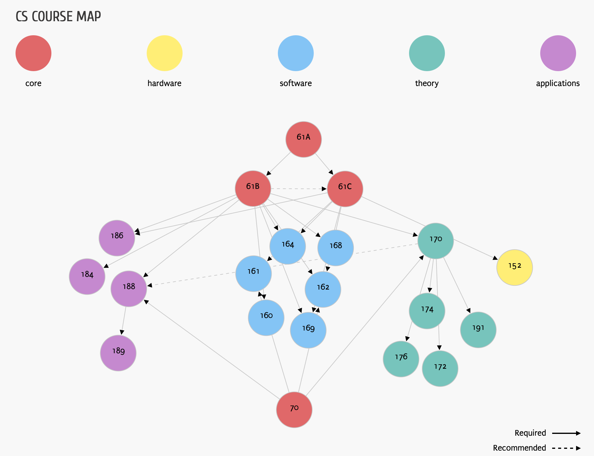
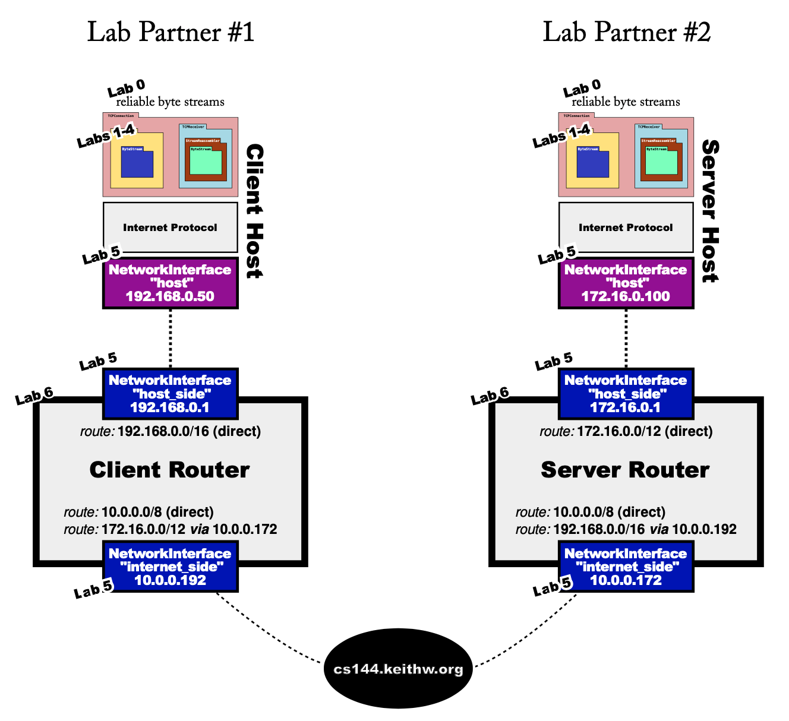

# Self-learning-Computer-Science

**News: 中文版已发布，请点击[这里](https://github.com/PKUFlyingPig/cs-self-learning).**

I'm an undergraduate student majored in Computer Science in Peking University. Tired of the boring courses, I began self-learning totally after my fresh year. This repository contains all the resources I used to self-learning. The links below will take you either to another repository which contains my solution for homework and course projects or to the course website where you can get full guidance.

If you feel quite painful to take the courses at unversity. Trust me, there is high possibility that it's not your duty. Computer Science is so interesting and everyone should enjoy it if you have a good teacher to teach you a good course.

All the courses in this repository are developed in MIT, UC Berkeleys, Princeton, Harvard ...... , and I guarantee you will have a completely different experience to take these courses !

Let's self-learning together and get better together !

If you find this repo helpful for you, your 🌟 is the best gift for me ~ 

## Overview

This guidance is a little bit long and may grow as I learn. Here are the section links. After each section, there is a ↩ which can link you back into Overview.

[Great Resources](#great-resources)

[Maths Courses](#maths-courses-)

[Programming Basics](#programming-basics-)

[Data structures and Algorithms](#data-structures-and-algorithms-)

[Electronical Engineering Basics](#electronical-engineering-basics-)

[Computer Architecture](#computer-architecture-)

[Machine Learning and Deep Learning](#machine-learning-and-deep-learning-)

[Computer Systems](#computer-systems-)

[Software Engineering](#software-engineering)

## Great Resources

Some people asked me how can I find these wonderful courses. Here are some great links that I used to choose my learning materials.

[MIT OpenCouse Ware](https://ocw.mit.edu/courses/#electrical-engineering-and-computer-science): There are hundreds of thousands of MIT courses in this website including all the subjects you can name. 

[UC berkeley EECS course map](https://hkn.eecs.berkeley.edu/courseguides): The map details the UC berkeley EECS courses dependancy and has links to each course's official website.

[UC berkeley CS Course List](https://www2.eecs.berkeley.edu/Courses/CS/?_ga=2.49145060.370293363.1598336094-476512950.1598336094): The computer science courses list for UC berkeley's undergraduate students.

[MIT CS Course List](http://student.mit.edu/catalog/m6a.html): The computer science courses list for MIT students.	

[↩](#overview)																												

## Maths Courses 📖

I'm a fan in math, so I took many maths courses which CS students are not obligated to take. So feel free to take the ones you like !

### 1. Basics 🌱

---

#### 1.1 Calculus and Linear Algebra 

| Course Link                                                  | Difficulty |
| :----------------------------------------------------------- | ---------- |
| [MIT18.01: Single variable calculus](https://ocw.mit.edu/courses/mathematics/18-01sc-single-variable-calculus-fall-2010/syllabus/) | 🌟🌟         |
| [MIT18.02: Multi variable calculus](https://ocw.mit.edu/courses/mathematics/18-02sc-multivariable-calculus-fall-2010/) | 🌟🌟🌟        |
| [MIT18.06: Linear Algebra](https://ocw.mit.edu/courses/mathematics/18-06sc-linear-algebra-fall-2011/syllabus/) | 🌟🌟🌟        |

Think you have already been expert in these three courses ? Trust me, spend some time reading the course notes, it will deepen your understanding !

#### 1.2 Basics of Information theory

| Course Link                                                  | Difficulty |
| ------------------------------------------------------------ | ---------- |
| [MIT6.050J: Information theory and Entropy](https://ocw.mit.edu/courses/electrical-engineering-and-computer-science/6-050j-information-and-entropy-spring-2008/index.htm) | 🌟🌟         |

This course is designed for freshman in MIT. I strongly recommend you to take it to understand some basic concepts in information theory.

[↩](#overview)

### 2. Intermediate 😊

---

#### 2.1 Probability theory

| Course Link                                                  | My repository                                         | Difficulty |
| ------------------------------------------------------------ | ----------------------------------------------------- | ---------- |
| [UCB CS70 : discrete Math and probility theory](http://www.eecs70.org) | [Completed](https://github.com/PKUFlyingPig/UCB-CS70) | 🌟🌟🌟        |
| [MIT6.431: Probabilistic Systems Analysis and Applied Probability](https://ocw.mit.edu/courses/electrical-engineering-and-computer-science/6-041sc-probabilistic-systems-analysis-and-applied-probability-fall-2013/index.htm) |                                                       | 🌟🌟🌟🌟       |
| [UCB CS126 : Probility theory](https://inst.eecs.berkeley.edu/~ee126/fa20/content.html) | [Ongoing](https://github.com/PKUFlyingPig/EECS126)    | 🌟🌟🌟🌟🌟      |

I took these three courses about probility theory. The UCB CS126 has some really interesting labs where you can write code in python to solve some practical probability problems. I suggest you take the first two to enhance your theoretical basis then take the last one just for fun !

#### 2.2 Differential equations

| Course Link                                                  | Difficulty |
| ------------------------------------------------------------ | ---------- |
| [MIT18.03: differential equations](https://ocw.mit.edu/courses/mathematics/18-03sc-differential-equations-fall-2011/unit-i-first-order-differential-equations/) | 🌟🌟🌟        |
| [MIT18.04: Complex variables functions](https://ocw.mit.edu/courses/mathematics/18-04-complex-variables-with-applications-spring-2018/) | 🌟🌟🌟        |
| [MIT18.152: Partial differential equations](https://ocw.mit.edu/courses/mathematics/18-152-introduction-to-partial-differential-equations-fall-2011/index.htm) | 🌟🌟🌟🌟       |

MIT18.03 focuses on constant differential equations. To solve more interesting dynamic systems, we need to learn partial differential equations. Since PDE requires that you should know about complex variable functions, read the notes of MIT18.04 first !

#### 2.3 Numerical thinking

You may feel tired to learn theoretical math (come on, isn't it exciting ?)

Don't worry, you can use computer to do the math for you. Many MIT maths courses use Julia language to help you understand maths concepts and deal with the maths problems in real life !

| Course Link                                                  | My repository                                        | Difficulty |
| ------------------------------------------------------------ | ---------------------------------------------------- | ---------- |
| [MIT18.S191: Introduction to Computational Thinking](https://computationalthinking.mit.edu/Fall20/) | TBA                                                  | 🌟🌟         |
| [MIT18.330 : Introduction to numerical analysis](https://github.com/mitmath/18330) | [Ongoing](https://github.com/PKUFlyingPig/MIT18.330) | 🌟🌟🌟        |
| [MIT18.335 : Introduction to numerical method](https://ocw.mit.edu/courses/mathematics/18-335j-introduction-to-numerical-methods-spring-2019/index.htm) | TBA                                                  | 🌟🌟🌟🌟       |

In the first course, you will master julia and do some basic but interesting labs, e.g. image processing, ray tracing, climate simulation and so on !

Then you can use julia to do the numerical analysis ! (a sad story: there are also many theoretical contents ~)

If you find 18.330 a little bit easy, you can take the graduate-level course : MIT18.335.

[↩](#overview)

### 3. Advanced 🤯

| Course Link                                                  | My repository                                                | Difficulty |
| ------------------------------------------------------------ | ------------------------------------------------------------ | ---------- |
| [MIT18.650: Statistics for Applications](https://ocw.mit.edu/courses/mathematics/18-443-statistics-for-applications-spring-2015/index.htm) |                                                              | Unknown    |
| [MIT18.781: Theory of Numbers](https://ocw.mit.edu/courses/mathematics/18-781-theory-of-numbers-spring-2012/index.htm) |                                                              | Unknown    |
| [MIT6.441: Information Theory](https://ocw.mit.edu/courses/electrical-engineering-and-computer-science/6-441-information-theory-spring-2016/syllabus/) |                                                              | Unknown    |
| [Standford EE364A: Convex Optimization](http://stanford.edu/class/ee364a/index.html) | [Completed](https://github.com/PKUFlyingPig/Standford_CVX101) | 🌟🌟🌟🌟       |
| [Standford CS255: Cryptography](http://crypto.stanford.edu/~dabo/cs255/) |                                                              | Unknown    |

All the courses above are graduate-level and I haven't taken all of them. I may dive into some of them when I need. However, I personally recommend the Convex Optimization course. 

[↩](#overview)

## Programming Basics 💻

There are many programming courses for freshman, I find all of them interesting !

| Course Link                                                 | Language | Difficulty |
| ----------------------------------------------------------- | -------- | ---------- |
| [MIT missing-semester](https://missing.csail.mit.edu/2020/) | Shell    | 🌟🌟         |

Just as the course name indicated, this course will teach the missing things in the university courses. It will cover shell programming, git, vim editor, tmux, ssh, sed, awk and even how to beatify your terminal. Trust me, this will be your first step to become a hacker !

---

| Course Link                                                  | Language            | My repository                                      | Difficulty |
| ------------------------------------------------------------ | ------------------- | -------------------------------------------------- | ---------- |
| [UCB CS61A: Structure and Interpretation of Computer Programs](https://inst.eecs.berkeley.edu/~cs61a/su20/) | Python, SQL, Scheme | [Completed](https://github.com/PKUFlyingPig/CS61A) | 🌟🌟🌟        |

Have you ever heard about the legendary book SICP? but that book used the language "Scheme" which is not so popular today. This course uses Python to teach you the same idea! Isn't that cool ? Trust me, after this course, you will be expert in python!

---

| Course Link                                               | Language       | My repository                                        | Difficulty |
| --------------------------------------------------------- | -------------- | ---------------------------------------------------- | ---------- |
| [Havard: cs50](https://cs50.harvard.edu/x/2020/syllabus/) | C, Python, SQL |                                                      | 🌟🌟         |
| [Havard: cs50 ai](https://cs50.harvard.edu/ai/2020/)      | Python         | [Completed](https://github.com/PKUFlyingPig/cs50_ai) | 🌟🌟🌟        |

CS50 is the most popular courses in Havard University. In the first course you will learn C, Python and SQL. In the second course you will use python to learn some basic concepts about AI ! The most shining part of cs50 is the lab sections. There are many interesting labs that you want to dive into it once you hear about them: Minesweeper, crossword, Nim game, Tic-Tac-Toe and so on.

---

| Course Link                                               | Language | My repository                                       | Difficulty |
| --------------------------------------------------------- | -------- | --------------------------------------------------- | ---------- |
| [Stanford: CS106L](http://web.stanford.edu/class/cs106l/) | C++      | [Completed](https://github.com/PKUFlyingPig/CS106L) | 🌟🌟         |

This is a C++ programming course taught in Stanford University. It covers many modern features of C++ (c++11, c++17, c++20 ...), and will almost certainly help you understand C++ more in depth.

[↩](#overview)

## Data structures and Algorithms 📚

Now you may have some experience in programming, but the art of programming is not programming itself, but to use it to solve problems elegantly and efficiently ! So data structures and algorithms are the most important part for a qualified programmer no matter you want to be a full-stack engineer, a theorist or a deep learning researcher. 

And, it is actually very interesting to learn ~~ if you found it hard, it must be your teacher's guilty : (

| Course Link                                                  | Language | My repository                                      | Difficulty                     |
| ------------------------------------------------------------ | -------- | -------------------------------------------------- | ------------------------------ |
| [UCB CS61B: data structures and algorithms](https://sp18.datastructur.es) | Java     | [Completed](https://github.com/PKUFlyingPig/CS61B) | 🌟🌟🌟 (not hard, but code heavy) |

In this course you will learn Java and use it to implement many data structures and algorithms. I highly recommend you to take the Spring 2018 version where you can use the Gradescope to self-grade your code. See the course website for more details ! 

Also, this course has some great labs and projects. In labs, you will implement the data structure by yourself. While in projects, you will use data structures to solve real problems. For example, in project 1 you will simulate the N-body problem. In project 2, you will implement a game in java. In project 3, you will implement a mini-GoogleMap.

---

| Course Link                                                  | Language | My repository                                                | Difficulty                    |
| ------------------------------------------------------------ | -------- | ------------------------------------------------------------ | ----------------------------- |
| [Princeton: Algorithms I](https://www.coursera.org/learn/algorithms-part1) & [Princeton: Algorithms II](https://www.coursera.org/learn/algorithms-part2/home/welcome) | Java     | [Completed](https://github.com/PKUFlyingPig/Princeton-Algorithm) | 🌟🌟🌟(not hard, but code heavy) |

These two courses are the greatest algorithm courses I found in coursera.

Do you often forget how to implement a specific algorithms?  

I find the easiest way to master an algorithm is :

- first to know why do in this way
- second to know how to implement it
- then to use it to solve real problems

To know why you should do the algorithm in this way, I think the [open-sourced textbook](https://algs4.cs.princeton.edu/home/) of this course is very helpful, where you can find the rigorous mathematical proofs for all the algorithms in this course.

To know how to implement it, the author implements [all the algorithms in Java](https://algs4.cs.princeton.edu/code/) in a clear and efficient way. I find it very helpful to learn from official codes. 

Now the last and also the most exciting part —— use it to solve real problems. These are 10 projects in total where you can use algorithms to solve practical problems. 

---

| Course Link                                                  | Language | My repository                                          | Difficulty |
| ------------------------------------------------------------ | -------- | ------------------------------------------------------ | ---------- |
| [UCB CS170: Efficient Algorithms and Intractable Problems](https://cs170.org) | Latex    | [Completed](https://github.com/PKUFlyingPig/UCB-CS170) | 🌟🌟🌟🌟       |

In this course you will learn more advanced algorithms like divide-and-conquer, dynamic programming, Network Flow, Graph algorithms Linear Programming and some NP problems.

This is a theoritic course where you do not need to write code but to design your algorithms and bound the time and memory complexity.

[↩](#overview)

## Electronical Engineering Basics 📟

As a CS student, it does not harm to learn some EE lessons to deepen your understandings on the hardware. I found these basic EE lessons will help you understand the ideas in computer architecture.

| Course Link                                                  | Language | My repository                                      | Difficulty |
| ------------------------------------------------------------ | -------- | -------------------------------------------------- | ---------- |
| [UCB: EE16A](https://inst.eecs.berkeley.edu/~ee16a/su20/#schedule) | Python   | [Completed](https://github.com/PKUFlyingPig/EE16A) | 🌟🌟         |
| [UCB: EE16B](https://www.eecs16b.org/#schedule)              | Python   | TBA                                                | 🌟🌟🌟        |

These two lessons are the introductary courses for freshman in UC Berkeley majored in EE. You can learn the basic ideas about circuits and some data analysis methods. You can also make your hands dirty in its labs.

---

| Course Link                                                  | Language | My repository                                          | Difficulty |
| ------------------------------------------------------------ | -------- | ------------------------------------------------------ | ---------- |
| [MIT 6.003 : signal and systems](https://www.eecs16b.org/#schedule) | ------   | -----                                                  | 🌟🌟🌟        |
| [UCB EE120 : signal and systems](https://inst.eecs.berkeley.edu/~ee120/fa19/) | Python   | [Completed](https://github.com/PKUFlyingPig/UCB-EE120) | 🌟🌟🌟        |

Signal and Systems is a very important course which will change your views of the world ! MIT 6.003 provides all the lecture videos and homework with solutions. UCB EE120 has some great course notes which I think are written in a very clear and easy to understand way. Personally I think the notes about Fourier transform are quite clear and great. So my recommended learning map is as follows :

- watch videos of MIT 6.003
- read the related notes of EE120
- complete the homework of MIT 6.003 to check your understanding
- complete the interesting labs of EE120 where you can use python to process real signals and solve practical problems (These labs are very very very interesting. For example, in lab3 you will implement your own FFT and compare it with numpy's version. In lab4 you will use the videos of your finger to predict your heart-beat rate. In lab5 you will restore blurred images taken by the Hubble Telescope. In lab6 you will control the small car to make it hold one stick.)

[↩](#overview)

## Computer Architecture 🗄

Now it's the most exciting part. When I was a little boy, people always told me that computer's world is just 0 and 1. I was so confused and sweared to understand how on earth the computer works in just 0 and 1. After learning these courses, you will understand it in depth.

| Course Link                                                  | Language                           | My repository                                             | Difficulty |
| ------------------------------------------------------------ | ---------------------------------- | --------------------------------------------------------- | ---------- |
| [Nand2Tetris I](https://www.coursera.org/learn/build-a-computer/home/week/1) & [Nand2Tetrix II](https://www.coursera.org/learn/nand2tetris2/home/welcome) | choose as you like, I chose Python | [Completed](https://github.com/PKUFlyingPig/NandToTetris) | 🌟🌟🌟        |

This course got 5.0 full score on coursera ! It is divided into two part : hardware part and software part.

Hardware part : you will use Nand gates to implement all the components (ALU, Memory, Decoder, Mutiplexer ... ...) of a running computer. In the end you will implement a CPU to run your machine code.

Software part : The author created a new language called Jack. You will write the compiler to translate the Jack code into your machine code and run it on the computer you made in the hardware part. Then you will implement a basic OS to do the input and output. Finally you can write a Tetris game in Jack and play it on the computer you made ! It is so coolllllll !

---

| Course Link                                                  | Language          | My repository                                               | Difficulty |
| ------------------------------------------------------------ | ----------------- | ----------------------------------------------------------- | ---------- |
| [UCB CS61C: Great Ideas in Computer Architecture](https://cs61c.org/su20/) | C, RISC-V, Logism | [Completed](https://github.com/PKUFlyingPig/CS61C-summer20) | 🌟🌟🌟🌟       |

Although Nand2Tetris course is great, it is not a university-level course. So to step further, CS61C is your choice.

All the labs and projects are fantastic. In this course, you will learn C programming language and RISC-V assembly language, understand how the computer runs your code, write a MNIST classification neural network in RISC-V, use Logism to build your own CPU to run RISC-V from scratch, and finally, you can write a naive, but quite powerful **numpy** in C to accelerate the matrix manipulation. This is the best architecture course I've ever taken !

---

| Course Link                                   | Language | Difficulty |
| --------------------------------------------- | -------- | ---------- |
| [CMU CS15213: CASPP](http://csapp.cs.cmu.edu) | C        | 🌟🌟🌟🌟🌟      |

This course is so well-known and I don't believe that you haven't heard about it before. Peking University has bought the copyright of this course so I took this course at school, but its official website has all the materials for you to complete the course. You can find course videos on Bilibili or Youtube. 

The most important part of this course is its 8 labs, but the labs are relatively hard comparing to the other labs in the above courses.

p.s. I was the TA for this course in 2020, and this repository is somewhat created for my seminar students. Thanks for their excellence to drive me to write this long long README : )

[↩](#overview)

## Machine Learning and Deep Learning 🧬

There are so many good resources on the Internet you can use to learn AI, machine learning and deep learning, below are just some courses which I prefer.

### 1. Introduction courses

- [UCB CS188: Introduction to Artificial Intelligence](https://inst.eecs.berkeley.edu/~cs188/fa18/index.html)

I recommend this 2018 version which you can use the gradescope. This course will teach you the basic ideas in AI, such as search, CSP, MDP, RL, BNs, NN,  logistic regression and so on.

- [MIT 6.S191: Introduction to Deep Learning](http://introtodeeplearning.com)

In this course you will learn the basic neural network such as CNN, RNN, GAN, VAE, and learn to use tensorflow in the labs.

### 2. Machine Learning

- [Stanford CS229: Machine Learning](http://cs229.stanford.edu/syllabus.html)
  - [My repository](https://github.com/PKUFlyingPig/CS229)

This course is taught by Andrew Ng (吴恩达). This couse is maths heavy. If you feel painful, you can take the coursera Machine Learning course which is also taught by Andrew. I finished the coursera course's labs too, they are quite interesting !

- [UCB CS189: Machine Learning](https://www.eecs189.org)

### 3. Deep Learning

- [Stanford CS231n: Convolutional Neural Networks for Visual Recognition ](http://cs231n.stanford.edu)
- [Stanford CS224n: Natural Language Processing](http://web.stanford.edu/class/cs224n/index.html)
  - [My repository](https://github.com/PKUFlyingPig/CS224n)

- [Stanford CS224W: Graphic Neural Network](http://web.stanford.edu/class/cs224w/)
- [Stanford CS234: Reinforce Learning](https://github.com/Zhenye-Na/reinforcement-learning-stanford)

[↩](#overview)

## Computer Systems 🧙

### 0. System Programming

| Course Link                                                  | Language | Repository                                          | Difficulty |
| ------------------------------------------------------------ | -------- | --------------------------------------------------- | ---------- |
| [Stanford CS110L](https://reberhardt.com/cs110l/spring-2020/) | Rust     | [Completed](https://github.com/PKUFlyingPig/CS110L) | 🌟🌟🌟🌟       |

In this course, you will learn [Rust](https://www.rust-lang.org/), a magic language with C's speed and other high level language's safety. It aims at empowering everyone to write efficient and safe software.

In this course, you will learn more than mastering a language. Rust's design philosophy will help you program elegantly and safely in other system programming language (e.g. C/C++). Also, the course focused on concurrency in the second half. You will trade off between multi-processing/multi-threading and event-driven programming and learn some subtle bugs when using them.

Personally, I love the "futures in Rust" part best. Future is a very weird concept and I spent two to three days to fully digest it. However, when you finally understand it, you will be amazed by its elegance and use it happily.

### 1. Operating System

| Course Link                                                  | Language | Repository                                                   | Difficulty |
| ------------------------------------------------------------ | -------- | ------------------------------------------------------------ | ---------- |
| [MIT 6.S081: Operating System](https://github.com/PKUFlyingPig/MIT6.S081-2020fall) | C        | [Completed](https://github.com/PKUFlyingPig/MIT6.S081-2020fall) | 🌟🌟🌟🌟🌟      |

This course is lab-driven, you will implement many features of a real operating system based on xv6 (a toy operating system which is designed for teaching). After finishing 11 labs, I'm sure you will have a deep understanding of the operating system.

---

### 2. Distributed System

| Course Link                                                  | Language | Repository                                          | Difficulty |
| ------------------------------------------------------------ | -------- | --------------------------------------------------- | ---------- |
| [MIT 6.824: Distributed Systems](https://pdos.csail.mit.edu/6.824/schedule.html) | Go       | [Ongoing](https://github.com/PKUFlyingPig/MIT6.824) | 🌟🌟🌟🌟🌟🌟     |

One paper per class!!  Wonderful labs !! You will implement a working Raft protocal and write your KV storing service based on it.

This course is graduate-level and very hard. I am trying to find some time to finish it.

---

### 3. Computer Network

| Course Link                                                  | Language | Repository                                                   | Difficulty |
| ------------------------------------------------------------ | -------- | ------------------------------------------------------------ | ---------- |
| [Computer Networking: A top down approach](https://gaia.cs.umass.edu/kurose_ross/wireshark.htm) | Python   | [Completed](https://github.com/PKUFlyingPig/Computer-Network-A-Top-Down-Approach) | 🌟🌟🌟        |
| [stanford CS144: Introduction to computer network](https://cs144.github.io) | C++      | [Completed](https://github.com/PKUFlyingPig/CS144-Computer-Network) | 🌟🌟🌟🌟🌟      |

In the fall 2020, the authors of this wonderful book (A Top Down Approach) released his teaching videos online which you can use to supplement your learning. In its labs, you will use wireshark to catch real network packet to understand how each protocol works. 

The Stanford course is much harder and you can also find its teaching videos on Youtube or Bilibili. In its labs you will implement the TCP, Network Interface, IP routing and put them together to talk with other peers on the Internet. Sounds cool right? (a sad story: the labs are time-consuming, personally I spent 5-6 hours per lab on average). 

Here is the picture of what you will implement in CS144 labs :

 

---

### 4. Compiler

| Course Link                                                  | Programming Language | My repository                                                | Difficulty |
| ------------------------------------------------------------ | -------------------- | ------------------------------------------------------------ | ---------- |
| [Stanford CS143: Compilers](http://web.stanford.edu/class/cs143/) | Java or C            | [Ongoing](https://github.com/skyzluo/CS143-Compilers-Stanford) | 🌟🌟🌟🌟🌟      |

I am taking Compiler course at school this term. Hope I can have time to complete this legendary course.

---

### 5. Computer Security

| Course Link                                       | Programming Language | My repository                                          | Difficulty |
| ------------------------------------------------- | -------------------- | ------------------------------------------------------ | ---------- |
| [UCB CS161: Computer Security](https://cs161.org) | Python, Go, C        | [Completed](https://github.com/PKUFlyingPig/UCB-CS161) | 🌟🌟🌟🌟🌟      |

This course is divided into 5 sections:

- Security principles : how to design a secure system
- Memory safety : buffer overflow attack
- Cryptography : symmetric encryption, asymmetric encryption, MAC, digital signature .........
- Web : SQL, XSS, XSRF .......
- Networking : attacks for each layer

The shining part of the course is the labs and projects, which will greatly enhance your mastery of the knowledge.

- Labs : there are three labs in total
  - padding oracle : how to make use of the padding oracle to breach the block cypher.
  - a real attack : a real problem countered in the CS61A's exam file releasing
  - networking : packet sniffing
- Projects : there are three projects in total 
  - Proj1 : Hack into the VM using buffer overflow attacks. You will do real attacks on the providing virtualbox virtual machine.
  - **Proj2 (warning) :** This is a very code-heavy projects. You will implement a secure file sharing system in Go language. [Here is my implementation and design doc.](https://github.com/PKUFlyingPig/CS161-Project2-SecureFileShareSystem)(I spent three whole days to complete this project, 3k lines of code in total)
  - Proj3 : In this project, you will use what you have learned in web scurity to attack a poorly-implemented website. Unfortunately, this project is only available for the Berkeley's students. However, I found a great website [Hacker101](https://ctf.hacker101.com/ctf) which provides similar project.

---

### 6. Parallel Computing

| Course Link                                                  | Programming Language | My repository                                                | Difficulty |
| ------------------------------------------------------------ | -------------------- | ------------------------------------------------------------ | ---------- |
| [Stanford CS149 : Parallel Computing](http://cs149.stanford.edu/fall20/) | C/C++                | [Completed](https://github.com/PKUFlyingPig/CS149-parallel-computing) | 🌟🌟🌟🌟🌟      |

From smart phones, to multi-core CPUs and GPUs, to the world's largest supercomputers and web sites, parallel processing is ubiquitous in modern computing. The goal of this course is to provide a deep understanding of the fundamental principles and engineering trade-offs involved in designing modern parallel computing systems as well as to teach parallel programming techniques necessary to effectively utilize these machines. Because writing good parallel programs requires an understanding of key machine performance characteristics, this course will cover both parallel hardware and software design.

There are five programming assignments in the course. You will learn to analyze parallel program, write a CUDA renderer, use OpenMP to parallel BFS and use Spark to do the page rank.

---

### 7. Database System

| Course Link                                                  | Programming Language | My repository                                      | Difficulty |
| ------------------------------------------------------------ | -------------------- | -------------------------------------------------- | ---------- |
| [UCB CS186: Introduction to Database System](https://cs186berkeley.net/sp21/) | Java/SQL/MQL         | [Completed](https://github.com/PKUFlyingPig/CS186) | 🌟🌟🌟🌟🌟      |

How to write SQL queries? What happens after you type in the queries into the SQL command line tool? How to optimize the query? How to design your own database to fit your demand? How to run tons of queries concurrently? How to recover your database from a ... fire? How to parallel your queries? What is NoSQL and how to write quries in the NoSQL database Mongodb? What is MapReduce and Spark? If you are interested in any questions above or if you want to implement a relational database **yourself**, this course is your best choice! Wonderful learning materials and wonderful projects, no need to say more.

[↩](#overview)

## Software Engineering

All the programmers can write code, but how to write good code, how to write hundreds of thousands lines of good code is hard, and is even art. 

| Course Link                                                  | Programming Language | My repository                                                | Difficulty |
| ------------------------------------------------------------ | -------------------- | ------------------------------------------------------------ | ---------- |
| [MIT 6.031 : Software Construction](http://web.mit.edu/6.031/www/sp20/) | Java                 | [Ongoing](https://github.com/PKUFlyingPig/MIT6.031-software-construction) | 🌟🌟🌟        |

The primary goal in this course is learning how to produce software that is:

- **Safe from bugs**. Correctness (correct behavior right now) and defensiveness (correct behavior in the future) are required in any software we build.
- **Easy to understand**. The code has to communicate to future programmers who need to understand it and make changes in it (fixing bugs or adding new features). That future programmer might be you, months or years from now. You’ll be surprised how much you forget if you don’t write it down, and how much it helps your own future self to have a good design.
- **Ready for change**. Software always changes. Some designs make it easy to make changes; others require throwing away and rewriting a lot of code.

To achieve the goal, you will learn Java, learn how to write specifications, how to write tests, how to design good Abstract Data Types, how to write concurrent programs and so on.

---

| Course Link                                                  | Programming Language | My repository                                                | Difficulty |
| ------------------------------------------------------------ | -------------------- | ------------------------------------------------------------ | ---------- |
| [UCB CS169 : software engineering](http://www.saasbook.info/courses) | Ruby/Javascript      | [Ongoing](https://github.com/PKUFlyingPig/CS169-Software-Engineering) | 🌟🌟🌟🌟       |

Unlike other traditional software engineering course which teaches you the old "plan and document" method, Software as a Service (SaaS) and agile development is today's trend. This great course will guide you into the world of modern software engineering, which is widely used by almost all the big companies like Google, Amazon ... ...

---

| Course Link                                                  | Programming Language | My repository | Difficulty |
| ------------------------------------------------------------ | -------------------- | ------------- | ---------- |
| [MIT web development course](https://weblab.mit.edu/schedule/) | Javascript           | Ongoing       | 🌟🌟🌟        |

Do not have time to learn a comprehensive software engineering course ? Wanna develop your own website in two weeks ? Take this MIT's web development crash course! You will learn HTML/CSS/Javascript/React/NodeJS/MongoDB... ... almost all the critical things you need to know about web dev.

[↩](#overview)
